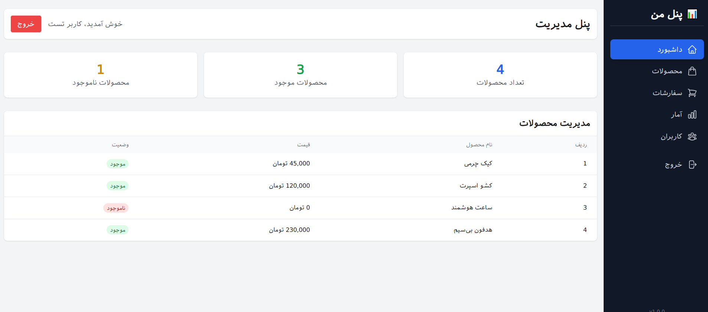
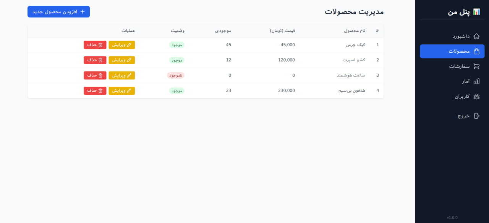
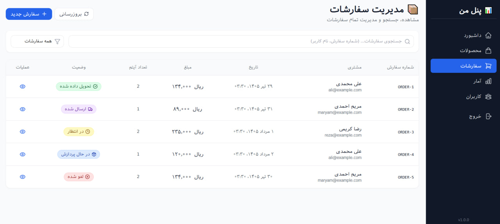
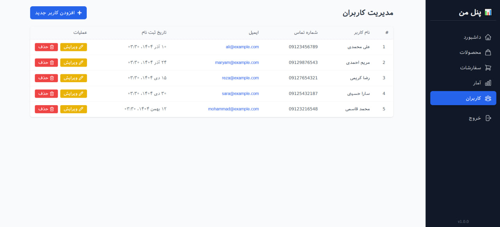

# 📊 داشبورد مدیریت فروشگاه



> **یک داشبورد مدیریتی کامل و مدرن برای فروشگاه‌های اینترنتی**  
> ساخته شده با Next.js 14، TypeScript و Tailwind CSS

---

## 📸 پیش‌نمایش از بخش‌های مختلف

| صفحه اصلی داشبورد                                  | مدیریت محصولات                                          | آمار و نمودارها                                          |
| -------------------------------------------------- | ------------------------------------------------------- | -------------------------------------------------------- |
|  |  |  |

> **نکته:** عکس مربوط به بخش [نام بخش، مثلاً: تنظیمات یا پروفایل] (تصویر `photo_2026-08-12_13-29-52.jpg`) نیز در پروژه موجود است.

---

## ✨ ویژگی‌های کلیدی

- 📊 **داشبورد تحلیلی** با نمایش نمودارهای فروش، بازدید و آمار کاربران
- 🛍️ **مدیریت جامع محصولات** (افزودن، ویرایش، حذف و دسته‌بندی)
- 👥 **مدیریت کاربران و سفارش‌ها** با امکان جستجو و فیلتر
- 📱 **طراحی کاملاً واکنش‌گرا** (مناسب برای موبایل، تبلت و دسکتاپ)
- 🔐 **سیستم احراز هویت امن** با NextAuth.js
- 🌙 **حالت تاریک/روشن** با قابلیت ذخیره‌سازی در مرورگر
- ⚡ **سرعت بالا** با استفاده از سرور کامپوننت‌های Next.js
- 📈 **گزارش‌گیری پیشرفته** از وضعیت فروش و موجودی

---

## 🛠️ تکنولوژی‌های استفاده شده

<p align="center">
  
  
  
  
  
  
</p>

_(اگر از کتابخانه یا ابزار دیگری مثل Prisma، Redux، یا Chart.js استفاده کردی، می‌توانی آن‌ها را به این لیست اضافه کنی.)_

---

## 🚀 نصب و راه‌اندازی

### پیش‌نیازها

- Node.js نسخه 18 یا بالاتر
- npm، yarn یا pnpm
- یک دیتابیس (مانند MongoDB یا PostgreSQL)

### مراحل اجرا

```bash
# ۱. کلون کردن ریپازیتوری
git clone https://github.com/amir-hosseini-front/dashboard-shop.git

# ۲. رفتن به پوشه پروژه
cd dashboard-shop

# ۳. نصب وابستگی‌ها
npm install
# یا
yarn install

# ۴. تنظیم متغیرهای محیطی (مرحله بعد را ببین)
# یک فایل .env.local ساخته و متغیرهای مورد نیاز را در آن قرار دهید.

# ۵. اجرا در حالت توسعه
npm run dev
# یا
yarn dev
```
